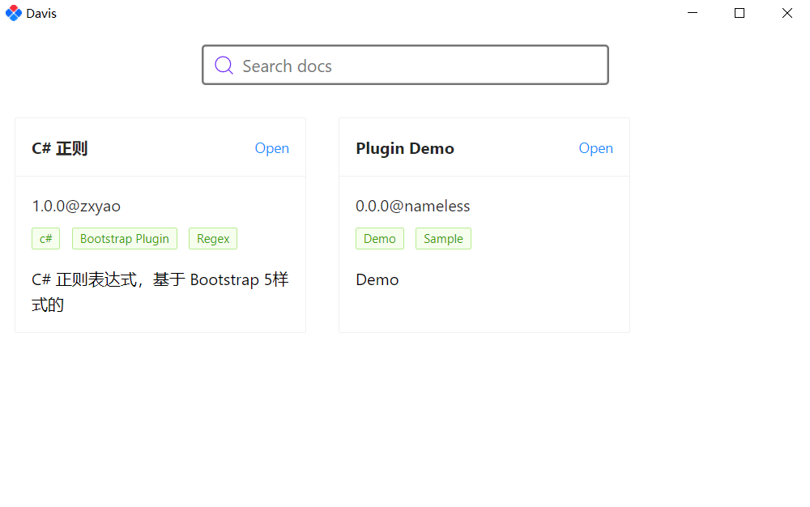

# Davis

a sample plugin application of blazor.



# Usage

## Create a plugin

1. Create a razor library
2. Make the library reference the project `Davis.Core`
3. Create a Component as the plugin entry point
4. Make the component implement the interface `Davis.Core.IDavisPlugin`. Note that there can **only be one** component that implements the `Davis.Core.IDavisPlugin` interface in the razor library.
5. Then, write your code.
6. Create a `_meta.json` file, to store metadata describing plugins: 

```json
{
  "name": "plugin's name", // required field
  "version": "1.0.0", // plugin's version
  "author": "plugin's author", 
  "description": "plugin's description",
  "tags": [ "c#", "Bootstrap Plugin", "Regex" ] // plugin's tags
}
```

More see the sample: `sample/CsRegexPlugin` and  `sample/MessagePlugin`.

### Dynamic Load js and css

1. Make sure the js and css file in the `wwwroot` directory.
2. Use **CascadingParameter** `IPluginContext` in the component.
3. Load css or js in the `SetParametersAsync` method, and unload  css or js in the `Dispose`. 

```razor
@implements Davis.Core.IDavisPlugin
@implements IDisposable

<div>
   
</div>

@code {
    [CascadingParameter]
    public Davis.Core.IPluginContext Context { get; set; } = default!;

    public override async Task SetParametersAsync(ParameterView parameters)
    {
        await base.SetParametersAsync(parameters);
        // assets/index.js and assets/index.css both in the wwwroot directory
        await Context.LoadJs("assets/index.js");
        await Context.LoadCss("assets/index.css");
    }


    public void Dispose()
    {
        _ = Context.UnLoadJs("assets/index.js");
        _ = Context.UnLoadCss("assets/index.css");
    }
}
```

## Using the plugin

1. publish the library to a directory, assuming that this directory is named `publish`
2. copy the `publish` directory to the `Plugins` directory of Davis, and **modify the name `pulish` to plugin name.**
3. make the the **razor library dll name is same with the plugin name**.
4. Run Davis application.

# OS

1. Photino.Blazor
2. AntDesign
3. Blazored.SessionStorage
4. Jil
5. Bootstrap

# LICENSE

Apache 2.0